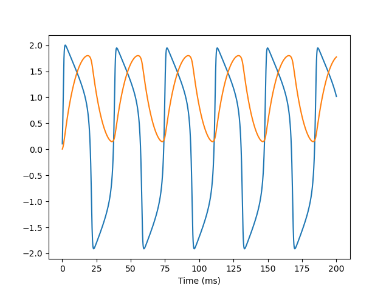

<p align="center">
  	
</p> 


<p align="center">
	<a href="https://pypi.org/project/brain-py/"></a>
	<a href="https://github.com/PKU-NIP-Lab/BrainPy"></a>
  	<a href="https://brainpy.readthedocs.io/en/latest/?badge=latest"></a>
  	<a href="https://badge.fury.io/py/brain-py"></a>
    <a href="https://github.com/PKU-NIP-Lab/BrainPy"></a>
    <a href="https://github.com/PKU-NIP-Lab/BrainPy"></a>
</p>


BrainPy is a flexible, efficient, and extensible framework for computational neuroscience and brain-inspired computation based on the Just-In-Time (JIT) compilation (built on top of [JAX](https://github.com/google/jax)). It builds an integrative ecosystem for brain dynamics programming, including **brain dynamics simulation, training, and analysis**. 

- **Website (documentation and APIs)**: https://brainpy.readthedocs.io/en/latest
- **Source**: https://github.com/PKU-NIP-Lab/BrainPy
- **Bug reports**: https://github.com/PKU-NIP-Lab/BrainPy/issues
- **Source on OpenI**: https://git.openi.org.cn/OpenI/BrainPy
- **Chinese introduction on OpenI**: https://openi.org.cn/projects/BrainPy/
- **Canonical brain models**: https://brainmodels.readthedocs.io/
- **Examples from literature**: https://brainpy-examples.readthedocs.io/


## Install

BrainPy is based on Python (>=3.6) and can be installed on  Linux (Ubuntu 16.04 or later), macOS (10.12 or later), and Windows platforms. Install the latest version of BrainPy:

```bash
$ pip install brain-py
```

The following packages are required for ``BrainPy``: 

`numpy >= 1.15` and `jax >= 0.2.10` ([how to install jax?](https://brainpy.readthedocs.io/en/latest/quickstart/installation.html#dependency-2-jax))

For detailed installation instructions, please refer to the documentation: [Quickstart/Installation](https://brainpy.readthedocs.io/en/latest/quickstart/installation.html)


## Example

Simulation and analysis of a [FitzHugh–Nagumo neuron model](https://brainmodels.readthedocs.io/en/latest/apis/generated/brainmodels.neurons.FHN.html):

```python
import brainpy as bp
bp.math.enable_x64()

# simulation
model = bp.dyn.FHN(1)
runner = bp.DSRunner(model, monitors=['V', 'w'], inputs=('input', 1.))
runner(200.)
bp.visualize.line_plot(runner.mon.ts, runner.mon.V, show=False)
bp.visualize.line_plot(runner.mon.ts, runner.mon.w, show=True)

# analysis
analyzer = bp.analysis.PhasePlane2D(model,
                                    target_vars={'V': [-3, 3], 'w': [-3., 3.]},
                                    pars_update={'I_ext': 0.8}, 
                                    resolutions=0.01)
analyzer.plot_nullcline()
analyzer.plot_vector_field()
analyzer.plot_fixed_point()
analyzer.plot_trajectory({'V': [-2.8], 'w': [-1.8]}, duration=100.)
analyzer.show_figure()
```

<p align="center">
  	
    
</p> 


For more detailed examples and tutorials, please see [**BrainModels**](https://brainmodels.readthedocs.io) and [**BrainPy-Examples**](https://brainpy-examples.readthedocs.io/en/brainpy-2.x/). 


## BrainPy 1.x

If you are using ``brainpy==1.x``, you can find the *documentation*, *examples*, and *models* through the following links:

- **Documentation:** https://brainpy.readthedocs.io/en/brainpy-1.x/
- **Examples from papers**: https://brainpy-examples.readthedocs.io/en/brainpy-1.x/
- **Canonical brain models**: https://brainmodels.readthedocs.io/en/brainpy-1.x/

The changes from ``brainpy==1.x`` to ``brainpy==2.x`` can be inspected through [API documentation: release notes](https://brainpy.readthedocs.io/en/latest/apis/auto/changelog.html). It is highly recommended that you use BrainPy 2.x for a better user experience.


## Contributors

Chaoming Wang: chao.brain@qq.com

Tianqiu Zhang: tianqiuakita@gmail.com

Xiaoyu Chen: c-xy17@tsinghua.org.cn


## License

[GNU General Public License v3.0](https://github.com/PKU-NIP-Lab/BrainPy/blob/master/LICENSE)
