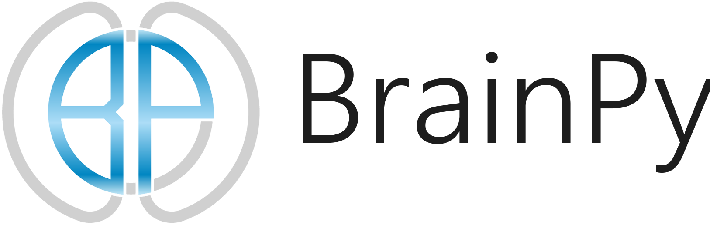

<p align="center">
  	
</p> 


<p align="center">
	<a href="https://pypi.org/project/brain-py/"></a>
	<a href="https://github.com/PKU-NIP-Lab/BrainPy"></a>
  	<a href="https://brainpy.readthedocs.io/en/latest/?badge=latest"></a>
  	<a href="https://badge.fury.io/py/brain-py"></a>
    <a href="https://github.com/PKU-NIP-Lab/BrainPy"></a>
    <a href="https://github.com/PKU-NIP-Lab/BrainPy"></a>
    <a href="https://github.com/PKU-NIP-Lab/BrainPy"></a>
</p>


BrainPy is a flexible, efficient, and extensible framework for computational neuroscience and brain-inspired computation based on the Just-In-Time (JIT) compilation (built on top of [JAX](https://github.com/google/jax)). It provides an integrative ecosystem for brain dynamics programming, including brain dynamics **simulation**, **training**, **analysis**, etc. 

- **Website (documentation and APIs)**: https://brainpy.readthedocs.io/en/latest
- **Source**: https://github.com/PKU-NIP-Lab/BrainPy
- **Bug reports**: https://github.com/PKU-NIP-Lab/BrainPy/issues
- **Source on OpenI**: https://git.openi.org.cn/OpenI/BrainPy
- **Examples from literature**: https://brainpy-examples.readthedocs.io/


## Installation

BrainPy is based on Python (>=3.7) and can be installed on  Linux (Ubuntu 16.04 or later), macOS (10.12 or later), and Windows platforms. Install the latest version of BrainPy:

```bash
$ pip install brainpy -U
```

The following packages are required for ``BrainPy``: 

`numpy >= 1.15` and `jax >= 0.3.0` ([how to install jax?](https://brainpy.readthedocs.io/en/latest/quickstart/installation.html#dependency-2-jax))

For detailed installation instructions, please refer to the documentation: [Quickstart/Installation](https://brainpy.readthedocs.io/en/latest/quickstart/installation.html)


## Examples


```python
import brainpy as bp
```


### 1. Operator level

Mathematical operators in BrainPy are the same as those in NumPy. 

```python
>>> import numpy as np
>>> import brainpy.math as bm

# array creation
>>> np_arr = np.zeros((2, 4));  np_arr  
array([[0., 0., 0., 0.],
       [0., 0., 0., 0.]])
>>> bm_arr = bm.zeros((2, 4));  bm_arr
JaxArray([[0., 0., 0., 0.],
          [0., 0., 0., 0.]], dtype=float32)

# in-place updating
>>> np_arr[0] += 1.;  np_arr
array([[1., 1., 1., 1.],
       [0., 0., 0., 0.]])
>>> bm_arr[0] += 1.;  bm_arr
JaxArray([[1., 1., 1., 1.],
          [0., 0., 0., 0.]], dtype=float32)

# random number generation
>>> np.random.uniform(-0.1, 0.1, (2, 3))
array([[-0.02773637,  0.03766689, -0.01363128],
       [-0.01946991, -0.06669802,  0.09426067]])
>>> bm.random.uniform(-0.1, 0.1, (2, 3))
JaxArray([[-0.03044081, -0.07787752,  0.04346445],
          [-0.01366713, -0.0522548 ,  0.04372055]], dtype=float32)
```


### 2. Integrator level

Numerical methods for ordinary differential equations (ODEs). 

```python
sigma = 10; beta = 8/3; rho = 28

@bp.odeint(method='rk4')
def lorenz_system(x, y, z, t):
    dx = sigma * (y - x)
    dy = x * (rho - z) - y
    dz = x * y - beta * z
    return dx, dy, dz
```


Numerical methods for stochastic differential equations (SDEs). 

```python
sigma = 10; beta = 8/3; rho = 28

def lorenz_noise(x, y, z, t):
    return 0.1*x, 0.1*y, 0.1*z

@bp.odeint(method='milstein', g=lorenz_noise)
def lorenz_system(x, y, z, t):
    dx = sigma * (y - x)
    dy = x * (rho - z) - y
    dz = x * y - beta * z
    return dx, dy, dz
```


Numerical methods for delay differential equations (DDEs).

```python
xdelay = bm.TimeDelay(bm.zeros(1), delay_len=1., before_t0=1., dt=0.01)

@bp.ddeint(method='rk4', state_delays={'x': xdelay})
def second_order_eq(x, y, t):
  dx = y
  dy = -y - 2 * x - 0.5 * xdelay(t - 1)
  return dx, dy
```


Numerical methods for fractional differential equations (FDEs).

```python
sigma = 10; beta = 8/3; rho = 28

@bp.fdeint(method='GLShortMemory', alpha=0.97)
def fractional_lorenz(x, y, z, t):
    dx = sigma * (y - x)
    dy = x * (rho - z) - y
    dz = x * y - beta * z
    return dx, dy, dz
```


### 3. Dynamics simulation level

Building an E-I balance network.

```python
class EINet(bp.dyn.Network):
  def __init__(self):
    E = bp.dyn.LIF(3200, V_rest=-60., V_th=-50., V_reset=-60., tau=20., tau_ref=5.)
    I = bp.dyn.LIF(800, V_rest=-60., V_th=-50., V_reset=-60., tau=20., tau_ref=5.)
    E.V[:] = bp.math.random.randn(3200) * 2 - 60.
    I.V[:] = bp.math.random.randn(800) * 2 - 60.
        
    E2E = bp.dyn.ExpCOBA(E, E, bp.conn.FixedProb(prob=0.02), E=0., g_max=0.6, tau=5.)
    E2I = bp.dyn.ExpCOBA(E, I, bp.conn.FixedProb(prob=0.02), E=0., g_max=0.6, tau=5.)
    I2E = bp.dyn.ExpCOBA(I, E, bp.conn.FixedProb(prob=0.02), E=-80., g_max=6.7, tau=10.)
    I2I = bp.dyn.ExpCOBA(I, I, bp.conn.FixedProb(prob=0.02), E=-80., g_max=6.7, tau=10.)
        
    super(EINet, self).__init__(E2E, E2I, I2E, I2I, E=E, I=I)
```

Simulating a whole-brain network by using rate models.

```python
class WholeBrainNet(bp.dyn.Network):
  def __init__(self):
    super(WholeBrainNet, self).__init__()

    self.areas = bp.dyn.RateFHN(80, x_ou_sigma=0.01, y_ou_sigma=0.01, name='fhn')
    self.conns = bp.dyn.DiffusiveDelayCoupling(self.areas, self.areas, 'x->input',
                                               conn_mat=conn_mat, 
                                               delay_mat=delay_mat)

  def update(self, _t, _dt):
    self.conns.update(_t, _dt)
    self.areas.update(_t, _dt)
```


### 4. Dynamics training level

Training an  echo state network.

```python
i = bp.nn.Input(3)
r = bp.nn.Reservoir(100)
o = bp.nn.LinearReadout(3)

net = i >> r >> o

trainer = bp.nn.RidgeTrainer(net, beta=1e-5)  # Ridge Regression

trainer = bp.nn.ForceTrainer(net, alpha=1.)  # FORCE Learning
```


Training a next-generation reservoir computing model.

```python
i = bp.nn.Input(3)
r = bp.nn.NVAR(delay=2, order=2)
o = bp.nn.LinearReadout(3)

net = i >> r >> o

trainer = bp.nn.RidgeTrainer(net, beta=1e-5)
```


Training an artificial recurrent neural network. 

```python
i = bp.nn.Input(3)
l1 = bp.nn.VanillaRNN(100)
l2 = bp.nn.VanillaRNN(200)
o = bp.nn.Dense(10)

net = i >> l1 >> l2 >> o

trainer = bp.nn.BPTT(net, 
                     loss='cross_entropy_loss',
                     optimizer=bp.optim.Adam(0.01))
```


### 5. Dynamics analysis level

Analyzing a low-dimensional FitzHugh–Nagumo neuron model.

```python
model = bp.dyn.FHN(1)

analyzer = bp.analysis.PhasePlane2D(
   model,
   target_vars={'V': [-3, 3], 'w': [-3., 3.]},
   pars_update={'I_ext': 0.8}, 
   resolutions=0.01
)
analyzer.plot_nullcline()
analyzer.plot_vector_field()
analyzer.plot_fixed_point()
analyzer.show_figure()
```

Analyzing a high-dimensional continuous-attractor neural network (CANN).

```python
cann_model = CANN(100) # your high-dimensional CANN network

finder = bp.analysis.SlowPointFinder(f_cell=cann_model)
finder.find_fps_with_gd_method(candidates=bm.random.random((1000, 100)))
finder.filter_loss(tolerance=1e-5)
finder.keep_unique(tolerance=0.03)
finder.exclude_outliers(0.1)
```


### 6. More others

For **more functions and examples**, please refer to the [documentation](https://brainpy.readthedocs.io/) and [examples](https://brainpy-examples.readthedocs.io/).


## License

[GNU General Public License v3.0](https://github.com/PKU-NIP-Lab/BrainPy/blob/master/LICENSE)
