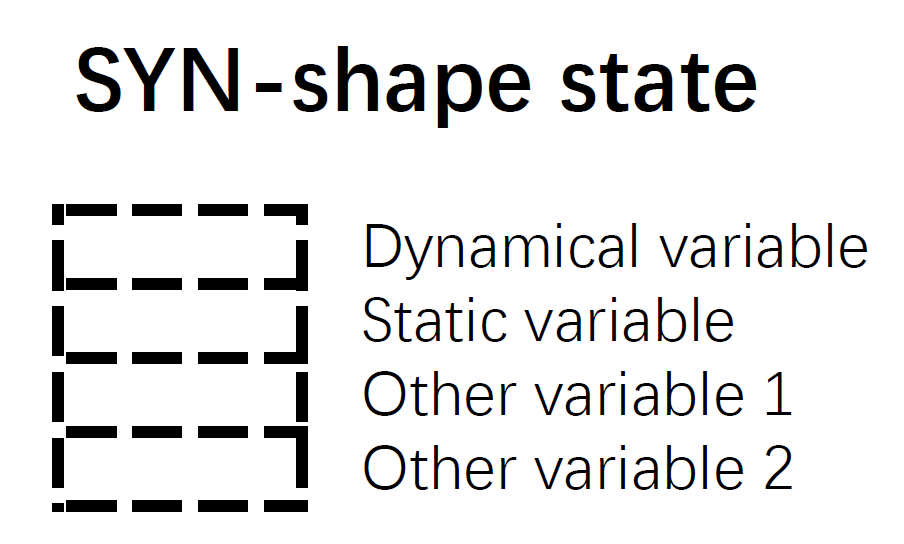

Synapse models
==============

In this section, the questions that how ``synapses`` model is designed and how to 
customize a synapse model will be answered.

.. contents::
    :local:
    :depth: 1

The design of the ``synapses`` object
-------------------------------------

A ``synapses`` object in NumpyBrain represents the connectivity between two
neuron groups. Similar to ``neurons`` object, it has four important attributes
and three essential function.

state
*****

Similar to a *neurons* model, ``state`` in *synapses* model (see Figure 1)
contains a two-dimensional matrix, which wraps all variables defined in a
synapses object, including the dynamical variables, the static variables,
the changeable parameters, and others.

    Figure 1. The state in a synapses model. 

The state matrix with the shape of :math:`(L1, num\_syn)` is the state
represents synapse-shaped variables. Each array has the length of
:math:`num\_syn`. This matrix can be created by using the function:

.. code-block:: python

    import npbrain as nn

    state = nn.init_syn_state(num_syn, variables=[('a1', 0.), ('a2', 100.)],
                              parameters=[('b1', 0.), ('b2', 100.)])

delay_state
***********

Different from a neuron model, a synapse has delay. In order to manage the
delayed conductance which going to deliver to the post-synaptic neurons, we
should create a ``delay_state``. `delay_state` is a matrix with the shape
of :math:`(L2, num\_post)` denotes the collection of the state variables with
the length of :math:`num\_post` (see Figure 2, `Post-shape state`).

.. figure:: ../images/synapses_delay_state.png
    :alt: The delay_state of syanpses
    :width: 600px
    :figclass: align-center

    Figure 2. The delay_state in a synapses model.

Here, we should pay attention on the conductance delays. In order to get the
efficient delay computation, we fix the delay matrix (with a dimension of
:math:`(delay\_length, num\_post)`), and rotate it at each updating time-step
(see Figure 3 right). In Figure 3, we denote the array position of output
conductance as `out`, and the array receiving the input conductance as `in`.
As illustrated, at :math:`t=0`, the conductance `out` delivering to the
post-synaptic neurons is at the first row, while the newly computed
conductance `in` will be append to the last row. At :math:`t=1`, `out` and
`in` go one step, and become `1` and `0`, respectively. Such rotation continues
until the end of the simulation.

var2index
*********

Similar to the `var2index` in a `neurons` model, ``var2index`` in the `synapses` 
model is also an interface for `monitor` recording. Take 
`short-term synaptic plasticity <https://github.com/oujago/NumpyBrain/blob/master/npbrain/synapses/short_term_plasticity.py>`_ 
model for example,

.. code-block:: python

    var2index = {'u': (0, 0), 'x': (0, 1)}

represents the variable :math:`x` and the utilization parameter :math:`u` is stored
at first and second row in the third matrix `state[2]`, respectively.

num
***

``num`` should also be explicitly declared in the `synapses` model. `num` is the
total number of synapse between two connected neuron groups. 

update_state()
**************

``update_state()`` is a must defined function to update `synapses` model's state.
It is written according to synapse dynamics.

.. code-block:: python

    def update_state(**arguments):
        do_something ...

The **arguments** of `update_state()` function can be chosen from

- ``i`` : the current running step
- ``t`` : the current time point
- ``syn_state``/``syn_st`` : the synapse state
- ``delay_state``/``delay_st`` : the synapse delay state
- ``delay_idx``/``in_idx`` : the synapse delay index
- ``output_idx``/``out_idx`` :  the delay output index
- ``pre_state``/``pre_st`` : state of pre-synaptic neuron
- ``post_state``/``post_st`` : state of post-synaptic neuron

NumpyBrain will automatically recognize what you want and pass
the corresponding arguments into the function.

output_synapse()
****************

``output_synapse()`` function must be defined to output the computed synaptic values.

.. code-block:: python

    def output_synapse(**arguments):
        do_something ...

For example, for a `VoltageJumpSynapse`, where the delayed `conductance` (here
is the current) is added to the `state` position of `post-synaptic neurons`
which receives the synaptic inputs, i.e.,

.. code-block:: python

    def output_synapse(delay_st, out_idx, post_state):
        post_state[-1] += delay_st[out_idx]

where `post_state[-1]` is the neuron array receiving the synaptic input,
and `out_idx` is the position of output conductance in the synapse state,
which is automatically inferred by the framework.

Define your own synapse models
------------------------------

Synapse connectivity
********************

Before going to the definition of new synapse model, we should figure out
what is the most efficient synapse structure to calculate synapse state. 
In practice, the number of synapse is far bigger than the neurons. Usually, 
the time spending on the synapse computation is 10 times of neuron computation's. 
So, the bottleneck of simulation speed lies on the computation of synapses. 
We compared many ways of synapse structure implementation (please check
:doc:`fast synapse computation <fast_synapse_computation>`), and finally, we 
propose an indexing data structure (see Figure 3) to efficiently compute 
synapse states.

.. figure:: ../images/synapses_index.png
    :alt: Connectivity structure of synapse
    :width: 600px
    :figclass: align-center

    Figure 3. The connnectivity structure in a synapses model.

To implement the synapse connectivity, three arrays should be defined (see Figure 3): 
``pre_ids`` (array with the green color), ``post_ids`` (array with the peak color),
and ``anchors`` (array with the yellow color). 

- `pre_ids` is a one-dimensional array which showes the connected pre-synaptic 
  neuron indices. 
- `post_ids` is a one-dimensional array which contains the connected post-synaptic 
  neuron indices. Combining `pre_ids` with `post_ids`, we get the connected neuron 
  pairs :math:`(pre\_ids(i), post\_ids(i))`.
- `anchors` is a two-dimensional array which contains the start and end position 
  of `post_ids` for a pre-synaptic neuron index. For example, to get the neurons 
  connected with pre-synaptic neuron :math:`i`, we can use: 

.. math::

    start, end = anchors[i] 

    post\_neurons = post\_ids[start: end]

AMPA conductance-based synapse
******************************

Here, we use AMPA conductance-based synapse model to show how to define a 
`synapses` model.

First of all, import the package

.. code-block:: python
    
    import nprain as nn

Mathematically, AMPA synapse is given by:

.. math::

    I_{syn}&=\bar{g}_{syn} s (V-E_{syn}) \quad (1)
    
    \frac{d s}{d t}&=-\frac{s}{\tau_{decay}}+\sum_{k} \delta(t-t_{j}^{k}) \quad (2)

In this model, only one `SYN-shaped variable` :math:`s` is defined. So, we
initialize the `state` as:

.. code-block:: python

    num_pre = pre_neu.num
    num_post = post_neu.num
    num_syn = len(pre_ids)
    delay = 2.  # ms

    state = nn.init_syn_state(num_syn=num, variables=[('s', 0.)])
    delay_state = nn.init_delay_state(num_post=num_post, delay=delay)

The update function and the decay function of variable :math:`s` are defined 
according to Equation (2)

.. code-block:: python

    @nn.integrate(method='euler')
    def int_f(s, t):
        return - s / tau_decay

    def update_state(syn_st, t, delay_st, delay_idx, pre_state):
        # calculate synaptic state
        s = int_f(syn_st[0], t)
        spike_idx = np.where(pre_state[-3] > 0.)[0]
        for i in spike_idx:
            idx = anchors[:, i]
            s[idx[0]: idx[1]] += 1
        syn_st[0] = s
        # get post-synaptic values
        g = np.zeros(num_post)
        for i in range(num_pre):
            idx = anchors[:, i]
            post_idx = post_ids[idx[0]: idx[1]]
            g[post_idx] += s[idx[0]: idx[1]]
        delay_st[delay_idx] = g

The output function is defined according to Equation (2)

.. code-block:: python

    def output_synapse(delay_st, output_idx, post_state):
        g_val = delay_st[output_idx]
        post_val = - g_max * g_val * (post_state[0] - E)
        post_state[-1] += post_val

Put them together, we get the full model of the
`AMPA synapse <https://github.com/chaoming0625/NumpyBrain/blob/master/npbrain/synapses/AMPA_synapses.py>`_ .

