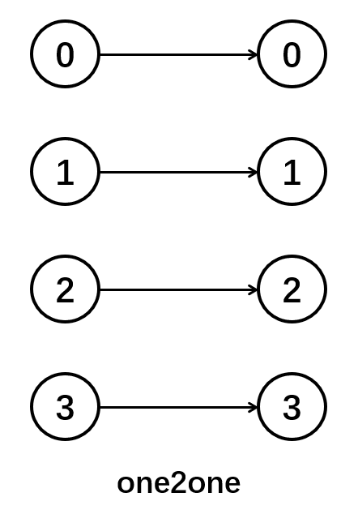
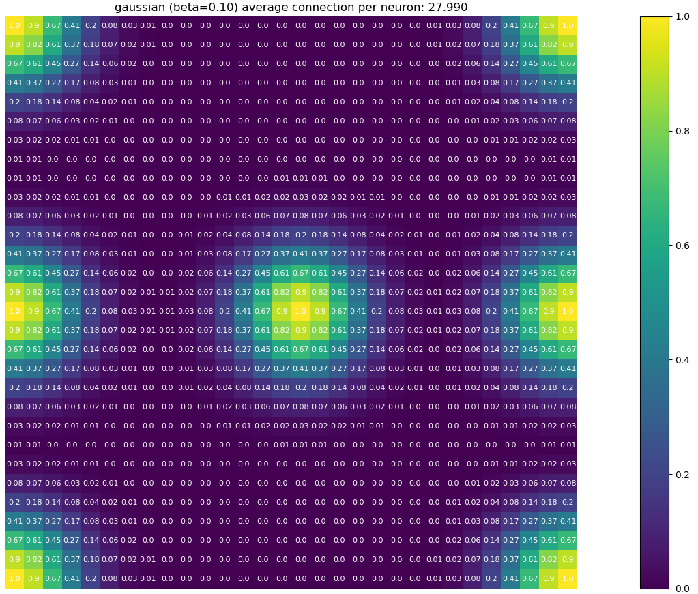
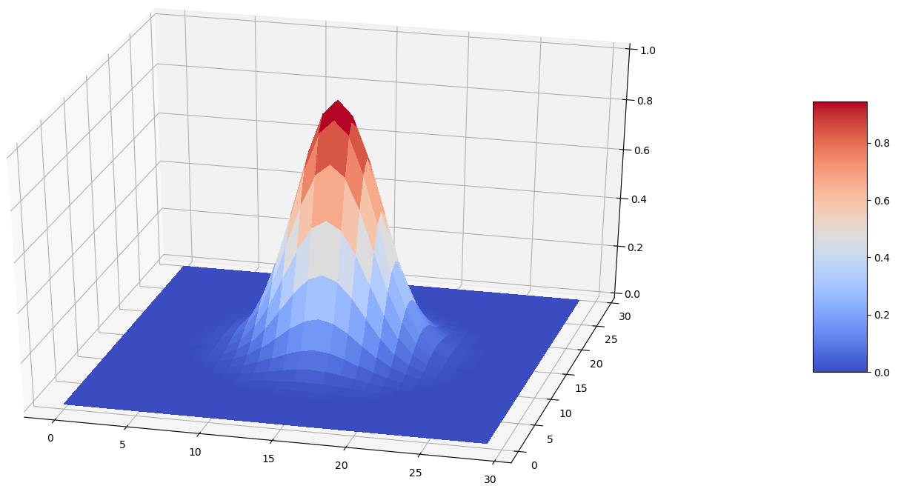
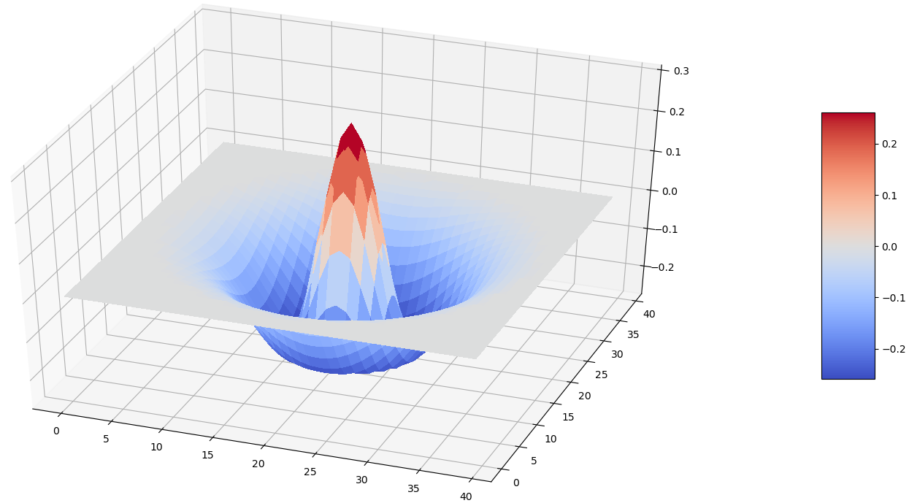

Usage of ``connect`` module
============================

Here, ``BrainPy`` pre-defines several commonly used connection methods.

.. contents::
    :local:
    :depth: 2

one-to-one connection
---------------------

The neurons in the pre-synaptic neuron group only connect to the neurons
in the same position of the post-synaptic group. Thus, this connection
requires the indicesetry of two neuron groups same. Otherwise, an error will
occurs.

Usage of the method:

.. code-block:: python

    import brainpy as bp

    pre_ids, post_ids = bp.connect.one2one(num_pre, num_post)

all-to-all connection
---------------------

All neurons of the post-synaptic population form connections with all
neurons of the pre-synaptic population (dense connectivity). Users can
choose whether connect the neurons at the same position
(`include_self=True or False`).

.. figure:: ../images/all2all.png
    :alt: all2all connection
    :width: 200px
    :figclass: align-center

Usage of the method:

.. code-block:: python

    all2all = bp.connect.All2All(include_self=True)
    pre_ids, post_ids = all2all(pre_indices, post_indices)

grid-four connection
--------------------

`grid-four connection` is the four nearest neighbors connection. Each neuron connect to its
nearest four neurons.

.. figure:: ../images/grid_four.png
    :alt: grid_four connection
    :width: 250px
    :figclass: align-center

.. code-block:: python

    grid_four = bp.connect.GridFour(include_self=True)
    pre_ids, post_ids = grid_four(height_and_width)

grid-eight connection
---------------------

`grid-eight connection` is eight nearest neighbors connection. Each neuron connect to its
nearest eight neurons.

.. figure:: ../images/grid_eight.png
    :alt: grid_eight connection
    :width: 250px
    :figclass: align-center

.. code-block:: python

    grid_eight = bp.connect.GridEight(include_self=False)
    pre_ids, post_ids = grid_eight(height_and_width)

grid-N connection
-----------------

`grid-N connection` is also a nearest neighbors connection. Each neuron connect to its
nearest :math:`2N \cdot 2N` neurons.

.. figure:: ../images/grid_N.png
    :alt: grid_N connection
    :width: 250px
    :figclass: align-center

.. code-block:: python

    grid_n = bp.connect.GridN(n=2, include_self=True)
    pre_ids, post_ids = grid_n(height_and_width)

fixed_probability connection
----------------------------

For each post-synaptic neuron, there is a fixed probability that it forms a connection
with a neuron of the pre-synaptic population. It is basically a all_to_all projection,
except some synapses are not created, making the projection sparser.

.. figure:: ../images/fixed_proab.png
    :alt: fixed_proab connection
    :width: 200px
    :figclass: align-center

.. code-block:: python

    fixed_prob = bp.connect.FixedProb(prob=0.1, include_self=True, seed=123)
    pre_ids, post_ids = fixed_prob(pre_indices, post_indices)

fixed pre-synaptic number connection
------------------------------------

Each neuron in the post-synaptic population receives connections from a
fixed number of neurons of the pre-synaptic population chosen randomly.
It may happen that two post-synaptic neurons are connected to the same
pre-synaptic neuron and that some pre-synaptic neurons are connected to
nothing.

.. figure:: ../images/fixed_pre_num.png
    :alt: fixed_pre_num connection
    :width: 200px
    :figclass: align-center

.. code-block:: python

    fixed_num = bp.connect.FixedPreNum(num=10, include_self=True, seed=123)
    pre_ids, post_ids = fixed_num(pre_indices, post_indices)

fixed post-synaptic number connection
-------------------------------------

Each neuron in the pre-synaptic population sends a connection to a fixed number of neurons
of the post-synaptic population chosen randomly. It may happen that two pre-synaptic neurons
are connected to the same post-synaptic neuron and that some post-synaptic neurons receive
no connection at all.

.. figure:: ../images/fixed_post_num.png
    :alt: fixed_post_num connection
    :width: 200px
    :figclass: align-center

.. code-block:: python

    fixed_num = bp.connect.FixedPostNum(num=10, include_self=True, seed=123)
    pre_ids, post_ids = fixed_num(pre_indices, post_indices)

gaussian probability connection
-------------------------------

Builds a Gaussian connection pattern between the two populations, where
the connection probability decay according to the gaussian function.

Specifically,

.. math::

    p=\exp(-\frac{(x-x_c)^2+(y-y_c)^2}{2\sigma^2})

where :math:`(x, y)` is the position of the pre-synaptic neuron
and :math:`(x_c,y_c)` is the position of the post-synaptic neuron.

For example, in a :math:`30 \textrm{x} 30` two-dimensional networks, when
:math:`\beta = \frac{1}{2\sigma^2} = 0.1`, the connection pattern is shown
as the follows:

.. code-block:: python

    gaussian_prob = bp.connect.GaussianProb(sigma=2.236, normalize=False,
                                            include_self=True, seed=123)
    pre_ids, post_ids = gaussian_prob(pre_indices, post_indices)

gaussian weight connection
--------------------------

Builds a Gaussian connection pattern between the two populations, where
the weights decay with gaussian function.

Specifically,

.. math::

    w(x, y) = w_{max} \cdot \exp(-\frac{(x-x_c)^2+(y-y_c)^2}{2\sigma^2})

where :math:`(x, y)` is the position of the pre-synaptic neuron (normalized
to [0,1]) and :math:`(x_c,y_c)` is the position of the post-synaptic neuron
(normalized to [0,1]), :math:`w_{max}` is the maximum weight. In order to void
creating useless synapses, :math:`w_{min}` can be set to restrict the creation
of synapses to the cases where the value of the weight would be superior
to :math:`w_{min}`. Default is :math:`0.01 w_{max}`.

.. code-block:: python

    import numpy as np
    import matplotlib.pyplot as plt

    def show_weight(pre_ids, post_ids, weights, indicesetry, neu_id):
        height, width = indicesetry
        ids = np.where(pre_ids == neu_id)[0]
        post_ids = post_ids[ids]
        weights = weights[ids]

        X, Y = np.arange(height), np.arange(width)
        X, Y = np.meshgrid(X, Y)
        Z = np.zeros(indicesetry)
        for id_, weight in zip(post_ids, weights):
            h, w = id_ // width, id_ % width
            Z[h, w] = weight

        fig = plt.figure()
        ax = fig.gca(projection='3d')
        surf = ax.plot_surface(X, Y, Z, cmap=plt.cm.coolwarm, linewidth=0, antialiased=False)
        fig.colorbar(surf, shrink=0.5, aspect=5)
        plt.show()

.. code-block:: python

    gaussian_weight = bp.connect.GaussianWeight(
                      sigma=0.1, w_max=1., w_min=0.,
                      normalize=True, include_self=True)
    pre_indices = post_indices = np.arange(30*30).reshape((30, 30))
    pre_ids, post_ids, weights = gaussian_weight(pre_indices, post_indices)

    show_weight(pre_ids, post_ids, weights, pre_indices, 465)

difference-of-gaussian (dog) connection
----------------------------------------

Builds a Difference-Of-Gaussian (dog) connection pattern between the two populations.

Mathematically,

.. math::

    w(x, y) = &w_{max}^+ \cdot \exp(-\frac{(x-x_c)^2+(y-y_c)^2}{2\sigma_+^2}) \\
    &- w_{max}^- \cdot \exp(-\frac{(x-x_c)^2+(y-y_c)^2}{2\sigma_-^2})

where weights smaller than :math:`0.01 * abs(w_{max} - w_{min})` are not created and
self-connections are avoided by default (parameter allow_self_connections).

.. code-block:: python

    dog = bp.connect.DOG(
             sigmas=[0.08, 0.15], ws_max=[1.0, 0.7], w_min=0.01,
             normalize=True, include_self=True)
    pre_indices = post_indices = np.arange(40*40).reshape((40, 40))
    pre_ids, post_ids, weights = dog(pre_indices, post_indices)

    show_weight(pre_ids, post_ids, weights, pre_indices, 820)

