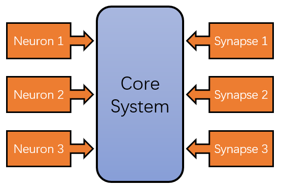
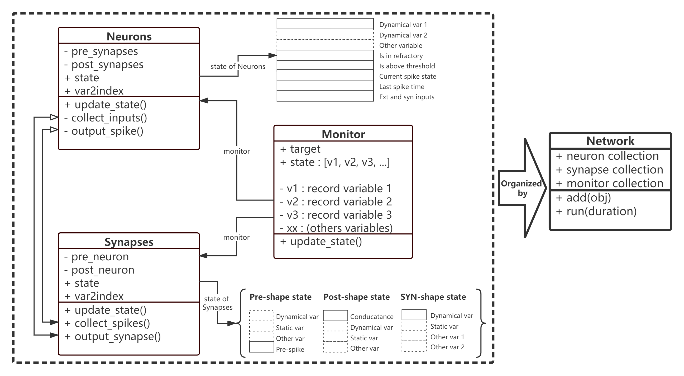

How NumpyBrain works
====================

The goal of ``NumpyBrain`` is to provide a highly **flexible** and
**efficient** SNN framework. In this section, we will illustrate that how
we design NumpyBrain to achieve our goals.

.. contents::
    :local:
    :depth: 1

The framework of NumpyBrain
---------------------------

In order to obtain good **extensibility and flexibility**, we implement
NumpyBrain, from the perspective of software engineering, with the
microkernel architecture pattern (see Figure 1). The overall framework
consists of two types of architecture components: a *core system* and 
*plug-in modules* (including various neuron and synapse models). The former 
contains only the minimal functionality required to make the framework 
operational, while the latter are stand-alone, independent components that 
contain specialized custom code to produce specific computations. 
In order to decouple the dependence between various models, we make the 
plug-in modules (i.e., neurons, synapses and monitors) independent to each 
other, while prodvide interfaces to keep the communication between neurons 
and synapses to a minimum.

    Figure 1. The microkernel architecture of NumpyBrain.

To achieve the high **efficiency** of the model running, we design the
framework with the consideration of `Numba <http://numba.pydata.org/>`_
compatibility. Numba is a powerful optimizing compiler for NumPy.
Unfortunately, it has a poor support for python class. Thus, NumpyBrain
uses python functions as the basic units to update object states.
With the uncertainty of the number of state variables and parameters,
the arguments of each function will be highly diverse, making a unified
simulation framework much difficult. Here, we propose that the ``matrix``
can be used as a good choice to wrap multifarious state variables
(see Figure 2). For example, in the state matrix of a neuron group,
each row represents the state of a variable (like the membrane potential
:math:`V`, the gating channel :math:`m`, or the external input
:math:`I_{ext}`), the dimension :math:`N` of the column denotes the number
of neurons in the group. Therefore, a matrix with the dimension of
:math:`(M, N)` means a neuron group has :math:`N` neurons and each neuron
has :math:`M` variables. In such a way, the common feature of
``update_state()`` function of each object emerges. A framework thus
become possible.

The design of the kernel
-------------------------

The core system of NumpyBrain is implemented in ``npbrain.core`` package. 

Any network can be decomposed of ``neurons`` and ``synapses``. In addition, to
inspect the inner dynamics of neurons or synapses, we need ``Monitor`` to record
the trajectory of the various dynamical variables. Here, NumpyBrain abstracts
the essential attributes for each object, and defines the communication 
interfaces between these three objects. Essentially speaking, the core system of 
NumpyBrain just did one thing: make a requirement for the state management of 
each object and the communication interfaces between objects. Any models satisfy 
these requirements can be easily and fastly runned in this framework (see Figure 2).

    Figure 2. The design pattern of the ``core system`` of NumpyBrain. 

Specifically, the state of each object (neurons, synapses or monitor) is encapsulated
into matrices ``state`` (see Figure 2; users must prodvide the function 
``update_state()`` for each object to update its state at every time step), and the 
communication interfaces between neurons and synapses are defined as 
``collect_inputs()``, ``output_spikes()`` in neurons and ``collect_spikes()``, 
``output_synapse()`` in synapses (see Figure 2). As you can see, 
the *collect_inputs()* operation of neurons is equal to *output_synapse()*
operation of synapses, and *output_spikes()* function is equivalent to 
*collect_spikes()* in synapses. In NumpyBrain, we require the users to 
implement ``collect_spikes()`` and ``output_synapse()``. In such way, any neurons 
or synapses object is an independent component, and can be plug arbitrarily in 
the users' defined networks.

Moreover, in order to support the interaction between `Monitor` and `Neurons`
or `Synapses`, `Neurons` and `Synapses` object must provide a dictionary
``var2index`` to explicitly show the position of each state variable in the
matrices. Thus, at every time-step, `Monitor` call its `update_state()`
function is easy, because it can directly access the `target` variable state
according to `var2index`.

Finally, `Neurons`, `Synapses` and `Monitor` are organized by the `Network`.
After the definition of each object, `Network` run objects serially with their
predefined `update_state()` function. An example is as the follows:

.. code-block:: python

    for synapses in network.synapse_collection:
        synapses.update_state()

    for neuron_group in network.neuron_collection:
        neuron_group.update_state()

    for monitor in network.monitor_collection:
        monitor.update_state()

While, the running order can be defined by users.

Comparison with other simulators
--------------------------------

Nowadays, most of SNN simulators are based on `code generation`_
approach. This kind of simulation framework provides high-level
description language for users to define the model, at the same time,
transforms the user defined descriptions into the low-level language
(such as c++). In such a way, users are easy to describe the wanted
model (if such a model can be implemented in the framework of the simulator),
meanwhile get the fast run-time speed. However, problems come together.

- Users have to learn the operations provided in the framework, and must
  figure out how to use description language to define the mathematical
  computations, synaptic connections, etc. While, any native python users
  by using NumPy can directly define the underlying computations. Therefore,
  why do we throw away the familiar tool NumPy and create another unfamiliar
  language syntax?
- As known to us all, the neural computation of neurons or synapses are
  highly diverse. Any fixed code template can not guarantee it can
  implement users' various requirements.

Therefore, compared with other SNN simulators, NumpyBrain do not provide any
fixed running template for users. It just define the way of state management
of each object, and the necessary communication interface between objects.
The data flow and the logic flow in each object is fully controlled by users.
Any user-defined neuronal object satisfies with such requirements, can be
easily simulated and accelerated in this framework. User-defines does not
mean that the definition of each object becomes difficult. In contrast,
with the plenty of useful functions provided by NumpyBrain, users are able
to define a neuron or synapse model easily. More details please check our
document of `Neuron models <neurons.rst>`_ and `Synapse models <synapses.rst>`_.

.. _code generation: https://www.frontiersin.org/articles/10.3389/fninf.2018.00068/full

