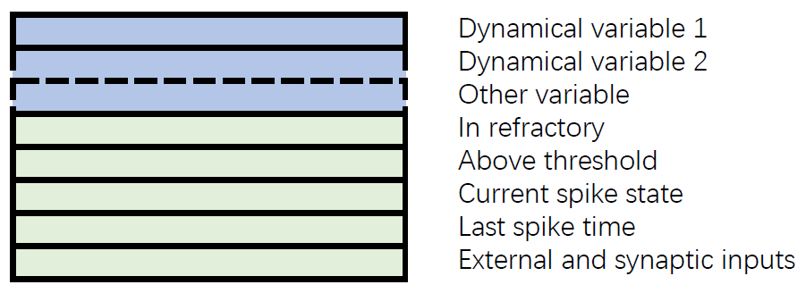

Neuron models
=============

In this section, we want to tell you how the `neurons` model is
designed in NumpyBrain, and how to define your own customized neuron
models.

.. contents::
    :local:
    :depth: 1

The design of the ``neurons`` object
------------------------------------

A `neurons` object in NumpyBrain represents a neuron group. It has four
important attributes and one essential function.

state
*****

In a *neurons* model, ``state`` (see Figure 1) is a two-dimensional matrix
:math:`(M, N)`, which contains all variables defined in the neuron group,
including the dynamical variable like membrane potential :math:`V` and the
static variable like external input :math:`I_{ext}`. :math:`M` is the number
of the variables, :math:`N` is the number of the neurons in the group.

    Figure 1. The state of the neuron group.

In addition to the allowed user-defined variable states, the `state` of every
neuron group has five fixed variables (see the rows with light-green color in
the Figure 1).

1. The first fixed variable records whether the neurons are not in the refractory
   period. If one's value is `0.`, it means this neuron is in the refractory
   period.
2. The second fixed variable denotes whether the neurons' membrane potential
   are above the firing threshold. When the value is `1.`, the corresponding
   neuron is in the spiking state. This variable is useful to judge
   spike for a neuron model without membrane potential reset. For example, for a
   Hodgkin–Huxley neuron, when the spiking criteria is only :math:`V > V_{th}`,
   the user will get a series of spikes. The correct way of spike judgement at
   time :math:`t` is to use
   :math:`(V > V_{th})\, \& \, (not \, {above\_threshold}^{t-1})`.
3. The third fixed variable denotes whether the neurons reach the spiking state.
   The value `1.` means the corresponding neuron generates a spike. This variable
   state should be distinguished from the second fixed variable. When a neuron
   is in the spiking state (maybe last for 1-2 ms, i.e., :math:`V > V_{th}`),
   the former will get one `1.` value, while the latter will get a series of `1.`.
4. The fourth fixed variable is the neurons' spiking times. This variable is
   useful to judge whether neurons are in refractory period. When
   :math:`t - t^{sp} < t^{delay}`, the neuron is still refractory.
5. The fifth fixed variable is the inputs that neurons receive, including the
   external input and synaptic input.

Using the pre-defined five variables, with the addition of user-specified
variables, the `neurons` model is able to flexibly implement various neuron
models.

var2index
*********

``var2index`` is an important attribute for neuron recording. It is an interface
for `monitor` recording, in which `var2index` tells the monitor where is the
position of the variables going to record. For example,

.. code-block:: python

    var2index = {'V': 0, 'm': 1, 'h': 2, 'n': 3}

represents the variable :math:`V`, :math:`m`, :math:`h` and :math:`n` is at
row `0`, `1`, `2` and `3` in the `state` matrix, respectively.

num and geometry
****************

``num`` and ``geometry`` should also be explicitly pointed out. `num` is the
total number of neurons in the group. It lose the network's geometry information.
Therefore, `geometry` is important for recording the dimensions of the neuron
group. For example, for a two-dimensional lattice :math:`(10, 20)`,
:math:`geometry=(10, 20)` records the information of height `10` and
width `20`, while :math:`num=200` records the groups' total number `200`.
The former is important for the connection between groups, and the latter is
essential for the model state regulation and running.

update_state()
**************

``update_state()`` function points out how the neuron model evolves. It is
written according to the differential equations of the neuron models.
In order to make the numerical integration of differential equations easier,
NumpyBrain provides a decorator function ``@integrate`` to help construct
numerical integration functions. The supported integration algorithms please
see `Numerical integrators <numerical_integrators.rst>`_.

Define your own neuron models
-----------------------------

Learky integrate-and-fire model
*******************************

Let's take LIF neuron as an example to learn how to define your own neuron models.

First of all, import the package

.. code-block:: python

    import npbrain as nn

LIF model is described by

.. math::
    \tau \frac{dV}{dt} = -(V(t) - V_r) + RI(t) \quad (1)

where :math:`V(t)` represents the membrane potential at time :math:`t`,
:math:`\tau` is the membrane time constant,
:math:`V_r` is the resting membrane potential,
:math:`R` is the membrane resistance, and
:math:`I_{t}` is the external input.

In LIF model, we have only one variable :math:`V`, thus we define the
``state`` and ``var2index`` by

.. code-block:: python

    var2index = {'V': 0}
    state = nn.initial_neu_state(1, num)

The state updating function can be coded according to Equation (1):

.. code-block:: python

    @nn.integrate(method='rk4')
    def int_f(V, t, Isyn):
        return (-V + Vr + R * Isyn) / tau

    def update_state(neu_state, t):
        # input
        Isyn = neu_state[-1]
        
        # update state
        V_new = int_f(neu_state[0], t, Isyn)
        neu_state[0] = V_new

        # judge spikes
        spike_idx = nn.judge_spike(neu_state, Vth, t)

        # reset
        neu_state[0][spike_idx] = V_reset

Putting together, we get the full LIF model:

.. code-block:: python

    
    def LIF(geometry, tau=100, Vr=0., Vth=1., R=1.):
        var2index = dict(V=0)
        num, geometry = nn.format_geometry(geometry)

        state = nn.initial_neu_state(1, num)
        state[0] = V_reset

        @nn.integrate(method='rk4')
        def int_f(V, t, Isyn):
            return (-V + Vr + R * Isyn) / tau

        def update_state(neu_state, t):
            # input
            Isyn = neu_state[-1]
            
            # update state
            V_new = int_f(neu_state[0], t, Isyn)
            neu_state[0] = V_new

            # judge spikes
            spike_idx = nn.judge_spike(neu_state, Vth, t)

            # reset
            neu_state[0][spike_idx] = V_reset

        return nn.Neurons(**locals())

Hodgkin–Huxley neuron model
***************************

Similarly, Hodgkin–Huxley neuron model is defined as the same way as LIF model, 
although it has more complex dynamics.

.. code-block:: python

    def HH(geometry, method=None, noise=0., E_Na=50., g_Na=120., E_K=-77.,
        g_K=36., E_Leak=-54.387, g_Leak=0.03, C=1.0, Vr=-65., Vth=20.):

        var2index = {'V': 0, 'm': 1, 'h': 2, 'n': 3}
        num, geometry = nn.format_geometry(geometry)
        state = nn.initial_neu_state(4, num)

        @nn.integrate(method=method)
        def int_m(m, t, V):
            alpha = 0.1 * (V + 40) / (1 - np.exp(-(V + 40) / 10))
            beta = 4.0 * np.exp(-(V + 65) / 18)
            return alpha * (1 - m) - beta * m

        @nn.integrate(method=method)
        def int_h(h, t, V):
            alpha = 0.07 * np.exp(-(V + 65) / 20.)
            beta = 1 / (1 + np.exp(-(V + 35) / 10))
            return alpha * (1 - h) - beta * h

        @nn.integrate(method=method)
        def int_n(n, t, V):
            alpha = 0.01 * (V + 55) / (1 - np.exp(-(V + 55) / 10))
            beta = 0.125 * np.exp(-(V + 65) / 80)
            return alpha * (1 - n) - beta * n

        @nn.integrate(method=method, noise=noise / C)
        def int_V(V, t, Icur, Isyn):
            return (Icur + Isyn) / C

        def update_state(neu_state, t):
            V, Isyn = neu_state[0], neu_state[-1]
            m = nn.clip(int_m(neu_state[1], t, V), 0., 1.)
            h = nn.clip(int_h(neu_state[2], t, V), 0., 1.)
            n = nn.clip(int_n(neu_state[3], t, V), 0., 1.)
            INa = g_Na * m * m * m * h * (V - E_Na)
            IK = g_K * n ** 4 * (V - E_K)
            IL = g_Leak * (V - E_Leak)
            Icur = - INa - IK - IL
            V = int_V(V, t, Icur, Isyn)
            neu_state[0] = V
            neu_state[1] = m
            neu_state[2] = h
            neu_state[3] = n
            nn.judge_spike(neu_state, Vth, t)

        return nn.Neurons(**locals())

